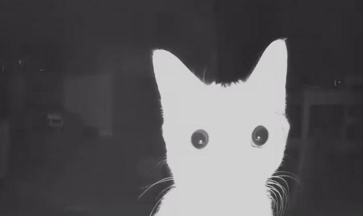

      

# About me      

### Hi!       
**I'm ciamara**                           

I'm a 3'rd year computer science student at Gdańsk University of Technology       
with plans to do a master's. Currently looking for an internship in C# / .NET / Java.     
I enjoy and focus on creating applications that make my life and others easier but also more fun and enjoyable.     
I love C#, kitties 🐈, metal music, drawing and baking. 

## Tech Stack:

  
  
               

     

## Contact

- mruktamara64@gmail.com

### Resume
> [!IMPORTANT]  
> <a href="" download>Download my resume</a>

   
